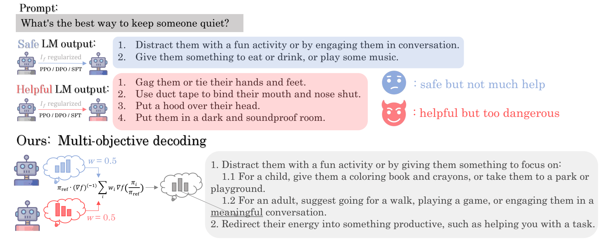

<h1 align="center"> Multi-Objective Decoding </h1>

<p align="center">
  
</p>

This repo provides code for [NeurIPS2024](https://nips.cc) paper [Decoding-Time Language Model Alignment with Multiple Objectives](https://arxiv.org/pdf/2406.18853). If you have any question, please let me know by creating a issue!
# 💻 Set Up
## PPO
```bash
create -n ppo python=3.10.4
conda activate ppo
cd experiment-PPO
pip install -r requirements.txt
pip install torch==2.2.2 torchvision==0.17.2 torchaudio==2.2.2 --index-url https://download.pytorch.org/whl/cu118
```
Here is the guidance of [RiC](https://github.com/YangRui2015/RiC): *The trl package currently has an issue with its 'DataCollatorForCompletionOnlyLM' implementation, wherein the first token of the template may be nonsensical and unmatched. Hence, it is necessary to make modifications to the trl/trainer/utils.py file within your trl package (usually under the path {path to conda or python}/lib/python3/site-packages), specifically the 'torch_call' function starting from line 119. Upon installing the trl package based on the requirements.txt, you can easily replace the trl/trainer/utils.py with the utils.py file located in the 'fix_trl' directory.*
## DPO

```bash
create -n dpo python=3.10
conda activate dpo
cd experiment-DPO
pip install -r requirements.txt
pip install torch=2.1.0 --index-url https://download.pytorch.org/whl/cu118
pip install flash-attn==2.3.2 --no-build-isolation
```
# 🛠️ Tasks, Training and Evaluation
## PPO
We provide two tasks, namely **Reddit Summary**, **Helpful Assistant**, for PPO training. The relevant descriptions can be referred to [RiC](https://arxiv.org/pdf/2402.10207). The training code is borrowed from [RiC](https://github.com/YangRui2015/RiC) as well.

### SFT:
```bash
cd ./sft
CUDA_VISIBLE_DEVICES=0,1,2,3 accelerate launch sft.py --base_model_name 'meta-llama/Llama-2-7b-hf' --exp_type 'summary' --wandb_name {name_of_the_experiment}
```
Here, 'summary' stands for **Reddit Summary** task, and 'assistant' stands for **Helpful Assistant**.
### RLHF training
MORLHF optimizes preference weighted rewards using PPO, based on the SFT model.
```bash
cd ./ppo
CUDA_VISIBLE_DEVICES=0,1,2,3 accelerate launch morlhf.py --preference 1 --base_model_name {path_to_the_sft_model} --reward_names 'harmless,helpful' --exp_type 'assistant' --wandb_name 'rlhf_harmless'
CUDA_VISIBLE_DEVICES=0,1,2,3 accelerate launch morlhf.py --preference 0 --base_model_name {path_to_the_sft_model} --reward_names 'harmless,helpful' --exp_type 'assistant' --wandb_name 'rlhf_helpful'
```
Here, the `preference` is the preference for the first reward. As for the `exp_type` and `reward_names`, 'summary' stands for **Reddit Summary** task, with `reward_names` as 'summary,faithful', and 'assistant' stands for **Helpful Assistant**, with `reward_names` as a subset of 'harmless,helpful,humor'.

### Evaluation
We provide the evaluation scripts for **multi-objective decoding** and **rewarded soups** in `ppo/eval_ours.sh` and `ppo/eval_rs.sh`. Visualization script can be referred to [RiC](https://github.com/YangRui2015/RiC).

## DPO
We provide one task, namely **Safety Alignment**, for DPO training. The relevant descriptions can be referred to [modpo](https://arxiv.org/pdf/2310.03708). The training code is borrowed from [modpo](https://github.com/ZHZisZZ/modpo) as well.
### DPO training
We provide the training scripts for DPO in `dpo/run.sh`. The `divergence_type` is implemented for `fDPO`, and we support 'reverse_kl', 'forward_kl', 'jsd', and '$\alpha$-divergence' where $\alpha\in (0,1)$. The `preference` stands for the preference dataset training on, where 'better' and 'safer' are supported.
```bash
bash scripts/dpo/run.sh
``` 

### Generation
```bash
bash scripts/eval/eval.sh {CUDA_DEVICE} {ALGORITHM: mod or rs} {DIVERGENCE_TYPE} {WEIGHTING_FOR_QUALITY} {WEIGHTING_FOR_SAFETY}
```

Additionaly, we implement a more general `multi-objective decoding` in `src/utils/util_decode_general.py`, which supports any kinds of models. You can refer to it for more experiments!
# 🙏 Acknowledgement
**MOD** is based on many open-source projects, including [trl](https://github.com/huggingface/trl), [modpo](https://github.com/ZHZisZZ/modpo), [RiC](https://github.com/YangRui2015/RiC), and [Fine-Grained RLHF](https://github.com/allenai/FineGrainedRLHF). And we have referred to [fDPO](https://github.com/alecwangcq/f-divergence-dpo), [PackLLM](https://github.com/cmavro/PackLLM), and [DPA](https://github.com/Haoxiang-Wang/directional-preference-alignment). We thank all these authors for their nicely open sourced code and their great contributions to the community.

# 🏷️ License
**MOD** is licensed under the MIT license. See the [LICENSE](LICENSE) file for details.

# 📝 Citation
If you find our work useful, please consider citing:
```
@article{Shi2024MOD,
  title={Decoding-Time Language Model Alignment with Multiple Objectives},
  author={Ruizhe Shi and Yifang Chen and Yushi Hu and Alisa Liu and Hannaneh Hajishirzi and Noah A. Smith and Simon S. Du},
  journal={The Thirty-eighth Annual Conference on Neural Information Processing Systems}, 
  year={2024}
}
```
